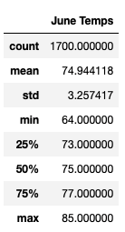
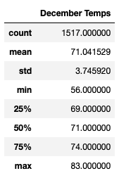
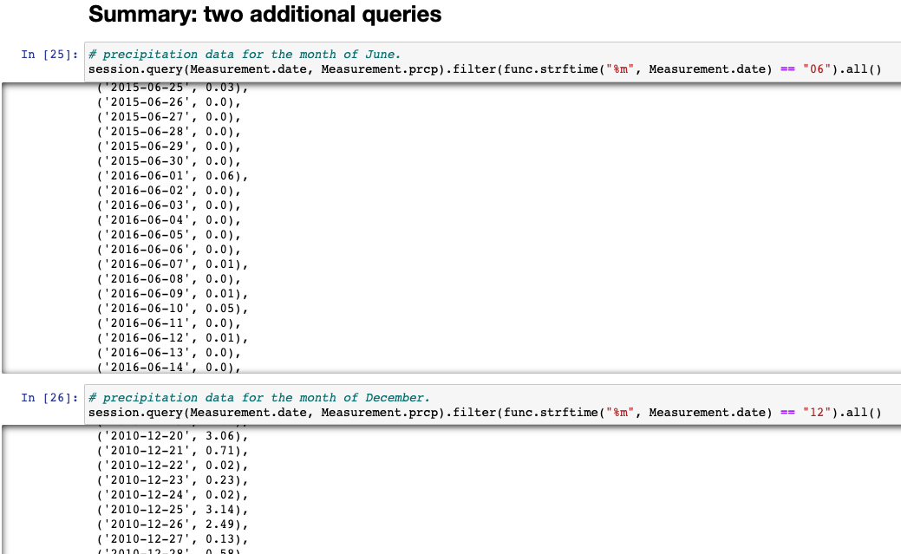

# surfs_up
## Overview of the analysis
### Purpose
The purpose of this project is to analyze the temperature data for June and December in Oahu, so W.Avy can see if the surf and ice cream shop could be sustainable throughout the year.

## Results
- The average temperature for June is 74.94 degrees, which is 3.9 degrees higher than the average temperature for December, 71.04 degrees.
- The minimum temperature for June is 64.0 degrees, which is 8.0 degrees higher than the minimum temperature for December, 56.0 degrees.
- The maximum temperature for June is 85.0 degrees, which is 2.0 degress higher than the maximum temperature for December, 83.0 degrees.

## Summary
The average temperature for June is only 3.9 degrees higher than the average temperature for December. But the minimum temperature for December is 56.0 degrees, which can be a factor in determining the sustainability of the surf and ice cream shop business. I would also include two additional queries to get the precipitation data for June and December, so I could check if the rain would be an another factor in determining the sustainability of the business.

